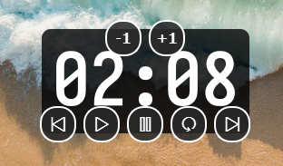
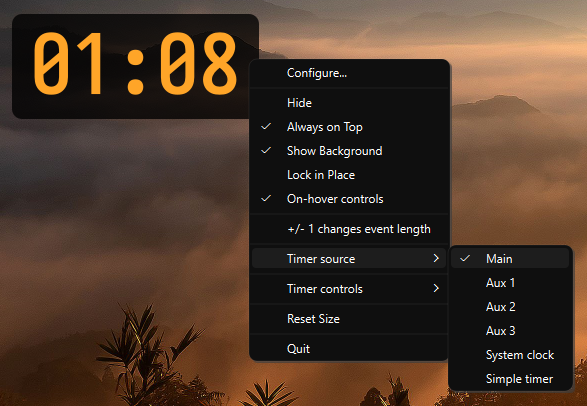
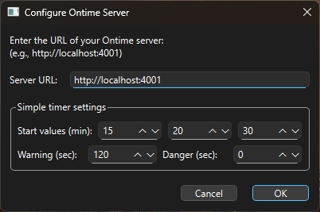

# FloatTime – Ontime Overlay Timer (with Simple Timer mode)

Lightweight desktop app that shows an always-on-top timer overlay. It can work with an Ontime server or in local **Simple timer** mode (no server required).

**Polish documentation:** [README.pl.md](README.pl.md)



## Configuration

The app stores configuration in a JSON file in the user directory:

**Windows:**
```
C:\Users\<username>\.floattime\config.json
```

**Linux/macOS:**
```
~/.floattime/config.json
```

Configuration options:
- `server_url` – Ontime server URL
- `display_mode` – Display mode: `"timer"` or `"clock"`
- `background_visible` – Background visibility (true/false)
- `window_size` – Window size: `[width, height]`
- `window_position` – Window position: `[x, y]` (restored on start; reset to default if outside available screen area)
- `locked` – Window lock state (true/false)
- `addtime_affects_event_duration` – When true, +/- 1 min changes the current event's duration only (no addtime); when false, +/- 1 min adds/removes time from the running timer (true/false)
- `headless_preset_minutes` – Three Simple timer presets in minutes (e.g. `[15, 20, 30]`)
- `headless_time_warning_sec` – Warning threshold for Simple timer in seconds (default `120`)
- `headless_time_danger_sec` – Danger threshold for Simple timer in seconds (default `0`)

You can edit this file manually or use the app’s context menu.

## Features

### Core
- **Always-on-top** – Timer stays above other windows (on macOS via native NSWindow level when PyObjC is installed)
- **Lightweight** – Python + PyQt6 (no Electron)
- **Cross-platform** – Windows, macOS, Linux
- **Dual source modes** – Ontime server mode or local **Simple timer** mode
- **URL configuration** – Configure Ontime URL when using Ontime mode
- **System tray** – Runs in the background with a tray icon
- **Client identification** – Sends a unique name (hostname + short random ID) to the Ontime server so each instance appears in the server’s client list
- **WebSocket auto-reconnect** – Retries connection every 3 seconds after disconnect/failure

### Window interaction
- **Dragging** – Move the window by dragging with the mouse
- **Resizing** – Resize from all four corners
- **Screen guard** – Window is clamped to the available screen geometry (stays on-screen; works across multiple monitors)
- **Position memory** – Last window position is saved and restored on start; if outside current screen area, position is reset to default
- **Smart cursor** – Cursor changes when hovering over corners
- **Auto-scaling** – Timer text scales to fit the window (binary search for optimal font size)
- **HiDPI** – Layout and fonts refresh when the window moves between screens with different DPI
- **No focus steal** – Clicking the overlay does not steal focus from other apps (e.g. PowerPoint stays active); on macOS this uses accessory activation policy and event handling
- **macOS: hover when inactive** – Control overlays (top/bottom buttons) appear on hover even when the app is not focused (via mouse polling)

### Timer controls (hover overlays)
- **Top edge** – **−1** and **+1** (subtract/add minute), centered
- **Bottom edge** – **‹ Previous**, **▶ Start**, **⏸ Pause**, **↻ Restart**, **› Next** (previous/next event, play, pause, restart, next event)
- Both groups appear when hovering over the window
- **Next** and **Previous** do not wrap (disabled at last/first event)
- In **Simple timer** mode:
  - **Previous/Next** switch between the 3 configured preset values
  - **+/- 1** changes current time and temporary start baseline
  - **Start** resumes (does not force reset)
  - **Restart** resets to the selected preset's original value (ignores +/- temporary edits)
  - **Blink/Blackout** also work locally

### Display
- **Display modes** – Switch between Ontime timer and system clock
- **Timer types** – Supports `count up`, `count down`, `clock`, `none`
- **Idle state** – When no event is loaded, shows `--:--` (dimmed) instead of the last timer value
- **Threshold colors** – Text color changes:
  - **White** – Normal
  - **Orange** (`#FFA528`) – Warning threshold
  - **Red** (`#FA5656`) – Danger/overtime
- **Transparent background** – Option to hide background for a fully transparent window
- **Custom font** – Timer and clock use Iosevka Fixed Curly from `fonts/` (fallback: Arial)
- **Control icon font** – On-hover control icons use Simple Line Icons from `fonts/Simple-Line-Icons.ttf`
- **Timer centering** – Timer text is centered (integral seconds; countdown uses ceiling so the first second is not skipped)

### Shortcuts and persistence
- **Saved settings** – Server URL, window size, window position, display mode, background visibility, locked state, +/- 1 affects event duration
- **Shortcuts**:
  - `Ctrl+Q` / `Ctrl+W` – Quit
  - `Escape` – Hide window
  - **Double-click** – Reload current event and start

## Requirements

- Python 3.9+
- Ontime server (local or remote) **optional** (not required in Simple timer mode)
- **macOS:** optional `pyobjc-framework-Cocoa` for reliable always-on-top (`pip install pyobjc-framework-Cocoa`)

## Building from source

1. Install dependencies:
```bash
pip install -r requirements.txt
```

2. Run the app:
```bash
python run.py
```

Or directly:
```bash
python src/main.py
```

## Configuration

### First run

On first run in Ontime mode, you’ll be asked for the Ontime server URL (e.g. `http://localhost:4001`).

### Changing settings

- **System tray** – Right-click the tray icon → “Configure...”
- **Context menu** – Right-click the timer window

### Menu options



- **Configure...** – Set Ontime server URL and Simple timer settings

  

- **Show / Hide** – Show or hide the window
- **Always on Top** – Toggle always-on-top
- **Show Background** – Toggle background (transparent/solid)
- **Lock in Place** – Lock position (disable drag and resize)
- **Timer source** – `Main`, `Aux 1`, `Aux 2`, `Aux 3`, `System clock`, `Simple timer`
- **Reset Size** – Restore default window size
- **+/- 1 changes event length** – When checked, +/- 1 min changes the current event's duration only (no running-timer addtime)
- **Timer** (submenu) – Previous event, Next event, Start, Pause, Restart, +1 min, −1 min, Blink, Blackout
- **Quit** – Exit the app

## Building an executable

The build script creates an isolated `.build_venv`, installs dependencies there, and runs PyInstaller so your main Python environment stays clean.

```bash
python build.py
```

Output in `dist/floattime/` (onedir mode). On macOS: `dist/floattime/floattime.app` or `dist/floattime/floattime`.

## Usage

### Basics

1. Start the app – it appears in the system tray.
2. Choose timer source in menu (`Timer source`).
3. If using Ontime source, set URL if prompted and data updates in real time via WebSocket.
4. Drag the window to move it (when not locked).
5. Hover over a corner and drag to resize.
6. Hover over the window to show −1/+1 at the top and Previous/Start/Pause/Restart/Next at the bottom.

### Resizing

- Hover over any of the four corners; the cursor changes (↖↘ or ↗↙).
- Click and drag to resize.
- Timer text automatically scales to use ~98% of the available space.

### Display modes

- **Timer** – Ontime timer or Simple timer
- **Clock** – System clock
- Toggle via tray or context menu.

### Threshold colors

- **Count down:** White (normal) → Orange (warning) → Red (danger/overtime)
- **Count up:** White (within time) → Orange (over duration)

## Project structure

```
FloatTime/
├── src/
│   ├── main.py              # Main application
│   ├── ontime_client.py     # Ontime API client (WebSocket)
│   ├── timer_widget.py      # Timer display widget
│   ├── timer_controls.py    # Control overlays (top: −1/+1, bottom: prev/play/pause/restart/next)
│   ├── local_timer.py       # Local Simple timer (no server mode)
│   ├── tray_manager.py      # System tray icon and menu
│   ├── config.py            # Configuration
│   ├── logger.py            # Logging (FLOATTIME_DEBUG)
│   └── ui/
│       └── config_dialog.py # Config dialog
├── fonts/                    # Custom font (Iosevka Fixed Curly)
├── hooks/                    # PyInstaller hooks (e.g. PyQt6)
├── requirements.txt
├── build.py                  # Build script (venv + PyInstaller)
├── run.py
├── README.md                 # This file (English)
└── README.pl.md              # Polish documentation
```

## Ontime API (Ontime mode)

The app connects to Ontime via WebSockets.

### WebSocket

- **Endpoint:** `ws://<server-url>/ws` (derived from configured `server_url` by replacing `http` with `ws` and appending `/ws`).
- **On connect:** the client sends a `client-set` message with `type` and `name` (name = hostname + short random ID) so the server can list the client, then `{"tag": "poll"}` to request initial/runtime data.
- **Reconnect:** on disconnect/failure, client retries every 3 seconds.
- **Incoming messages:** JSON with `tag` or `type` and `payload`; the app uses `payload` (or the whole message) as Ontime runtime data. Granular updates (`type`: `ontime-eventNow`, `ontime-timer`, etc.) are unwrapped so the payload is parsed.
- **Control (send):**
  - `{"tag": "start"}` – start the loaded event
  - `{"tag": "pause"}` – pause
  - `{"tag": "reload"}` – reload/restart current event
  - `{"tag": "load", "payload": "next"}` – load next event (no wrap at last event)
  - `{"tag": "load", "payload": "previous"}` – load previous event
  - `{"tag": "addtime", "payload": {"add": ms}}` – add time (e.g. 60000 for +1 min)
  - `{"tag": "addtime", "payload": {"remove": ms}}` – remove time (e.g. 60000 for −1 min)
  - `{"tag": "change", "payload": {"<event-id>": {"duration": ms}}}` – change current event duration (when “+/- 1 changes event length” is on)
  - `{"tag": "message", "payload": {"timer": {"blink": true/false}}}` – blink
  - `{"tag": "message", "payload": {"timer": {"blackout": true/false}}}` – blackout

### Data format (parsed from server)

The app parses Ontime-style JSON:

- **Top-level or nested:** `timer` (object or value), `timerType`, `eventNow` / `currentEvent`, `eventNext` / `nextEvent`, `rundown`, `status`, `running`.
- **Rundown:** `selectedEventIndex`, `numEvents` – used to enable/disable next and previous (no wrap).
- **Timer object:** `current`, `remaining`, `elapsed`, `playback`, `state`, `running`, `timerType`, `timeWarning`, `timeDanger`, `duration`.
- **Event:** `id`, `title`, `timerType`, `timeWarning`, `timeDanger`, `duration`, `timeStart`.

## Debugging

Enable verbose logging with:

```bash
export FLOATTIME_DEBUG=true   # Linux/macOS
set FLOATTIME_DEBUG=true      # Windows (cmd)
```

Then run the app; logs appear in the console.

## Troubleshooting

**Timer not updating**
- If using Ontime mode, check that the Ontime server is running and reachable at the configured URL.
- Enable `FLOATTIME_DEBUG=true` and check logs.
- Ensure the port isn’t blocked by a firewall.

**Window not visible**
- Check the system tray; the window may be hidden. Right-click the tray icon → “Show”.

**Always-on-top not working on macOS**
- Install: `pip install pyobjc-framework-Cocoa`
- Ensure “Always on Top” is enabled in the menu.

**Colors not changing**
- In Ontime, set `timeWarning` and `timeDanger` for the event.
- Use `FLOATTIME_DEBUG=true` to verify timer type detection.

## License

GNU GPL — see [LICENSE.md](LICENSE.md).

## Third-party font note

This project uses the Simple Line Icons font for control icons ond Iosevka for number display:
- [simplelineicons/simplelineicons.github.io](https://github.com/simplelineicons/simplelineicons.github.io)
- [be5invis/Iosevka](https://github.com/be5invis/Iosevka)
